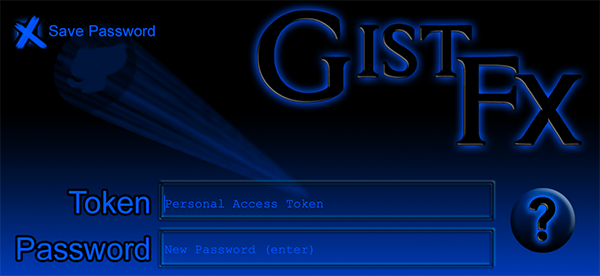

## GistFX

Forget using your default text editor application to jot down pieces of
code. Why not store these, instead, in a version controlled format?

GitHub Gists are a great way to store small code snippets, or even small
projects. GistFX provides a desktop Gist client, to make editing, creating, and
managing Gists a breeze.

### Features
  - Easily manage existing Gists, edit, or create new ones.
  - Assign names to your Gists in addition to the descriptions that GitHub requires.
  - Built-in syntax highlighting for most modern languages, using MonacoFX  - the same code editor used in Microsofts open source Visual Studio.
  - Authenticate with a GitHub access token, that can be saved locally in an encrypted format. GistFX has been designed to ensure your private information is for your eyes only. We value your security just as much as we value our own.
    - Click the question mark on the login screen to learn how to create a proper access token.
  - GistFX makes sure that even if you edit your Gists somewhere else,it never overwrites your most recent changes.
### Getting started

  1. Create a GitHub Personal Access Token for this application
     - This is far superior to user/pass authentication and is the only way GitHub allows access to your data.
     - Only gives GistFX the ability to access your Gists through the GitHub API.
       - Create by going to: GitHub -> Settings -> Developer Settings -> Personal access tokens -> Generate new token
         - [Or click here](https://github.com/settings/tokens/new)
         - ONLY check ONE box - Gist
    
  2. Build or download
     - Currently, GistFX can only run within the IDE. This will be resolved soon. If you are able to change the Maven POM file so that it generates a working artifact, then please submit a pull request. Though we expect to have this working soon.
---

### On first run

You will first be shown a window that explains the need for an access token as well as how to find the instructions for creating one.

Next, you will be presented with a login screen. Enter the GitHub personal access token that you created, along with a password that will be used to encrypt then locally store your personal access token.

  
 
If you uncheck the Save Token checkbox, you will be able to authenticate by simply entering your personal access token. However, each time you run GistFX, you will need to enter your token again.

---

Once you authenticate successfully to your GitHub account, your Gists are download and stored inside a SQLite databse. The data is first encrypted before it is stored for your protection. Then, any changes you make to your gists will be kept in the database until you upload them. Alternatively, you can click on Edit / User Options then set the Live Data source to GitHub so that your changes are committed to GitHub at an interval you specify.

See the Help menu for further discussion concerning the use and utility of GistFX. We think you will find this program to be very handy in the preservation of those code snippets that matter the most in your development endeavours.